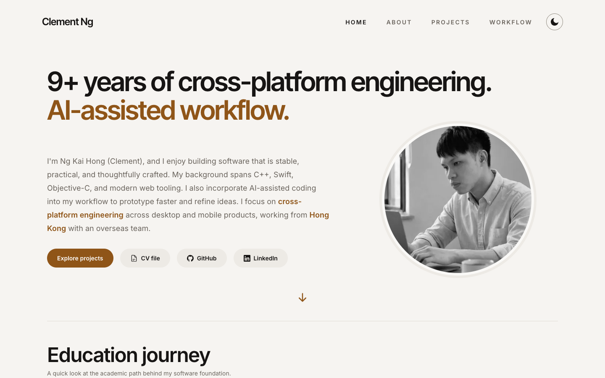
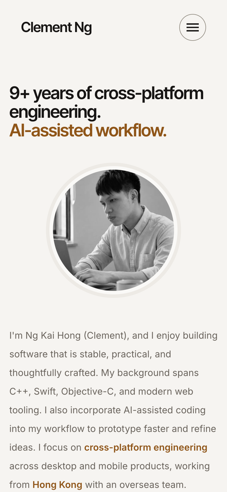

# Portfolio — Clement Ng

A single-page portfolio for Clement Ng, a senior software developer working on
cross-platform desktop and mobile products from Hong Kong. Live at
**https://clement-ng.vercel.app**, in a light and a dark theme.

Built with Next.js 16 (App Router, Turbopack), React 19, TypeScript 6 and
Tailwind CSS 4, deployed on Vercel.

<p>
  
  
</p>

## What's on the page

An introduction, education and work history, technical strengths, three
projects with their screens, and a Workflow section on how the site was built.
**[See it on the site →](https://clement-ng.vercel.app)**

## How it was built with an AI agent

Rebuilt with Claude Code under a gated workflow based on
[Monstrare](https://github.com/pjwang2022/Monstrare): the agent proposes
options and builds one task card at a time; I pick the option and review the
evidence before anything merges.
**[The loop, and one real decision traced end to end →](https://clement-ng.vercel.app/#workflow)**

## Running it

Node 24 (see `.nvmrc`).

```bash
npm install
npm run dev        # http://localhost:3000
```

```bash
npm run build      # production build
npm start          # serve it
```

## Checks

Every pull request runs these in CI, and `main` only accepts a branch that
passes them.

```bash
npx tsc --noEmit   # type check
npm run lint       # ESLint 9, flat config
npm run build
npm run smoke      # after a build: routes, share card, images, headers
npm run contrast   # after a build: WCAG AA text contrast, light and dark, 1440px and 375px
```

`smoke` starts the production server and checks what has broken before: the
share card, every image the page references, each image's declared aspect
ratio, and the security headers. `contrast` drives the local Chrome over the
DevTools protocol and fails if any visible text drops below AA. Neither adds a
dependency.

## Where things live

**All written content is in `lib/content.tsx`** — work history, education,
skills, projects and the Workflow section's copy. It is the single source of
truth: components read from it and hold no copy of their own, so text is
edited in one place. The file is `.tsx` rather than `.ts` because some bullets
emphasise a proper noun mid-sentence, and keeping those as JSX means the
wording is stored exactly as it reads. Each screenshot's real pixel size sits
next to its path, so the browser reserves the right box before it loads.

**Design tokens are in `styles/globals.css`** — the colour palette and motion
timing, defined as CSS custom properties and remapped under `.dark`.
Components read the semantic `--color-*` names directly. The same file's
`@theme` block is the Tailwind v4 configuration: type scale, card radius,
z-index layers, breakpoints and fonts. There is no `tailwind.config.ts`.

**Security headers are in `next.config.ts`.**
